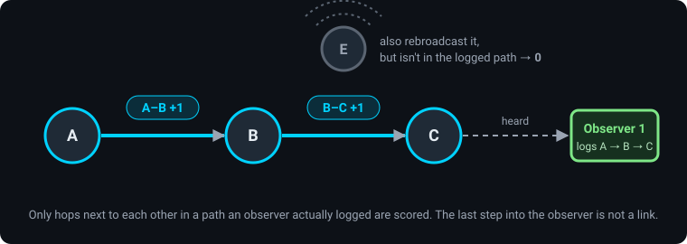
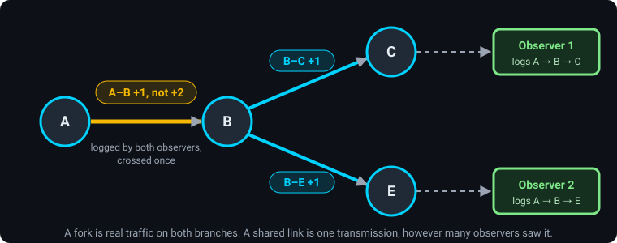
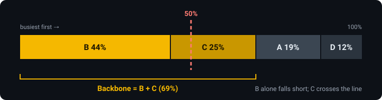
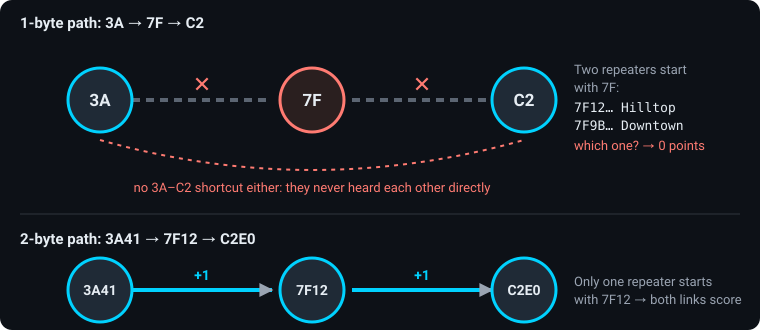

# Backbone

The **Backbone** layer highlights the repeaters that carry most of a region's traffic. A repeater is a **backbone site** when it belongs to the smallest group of repeaters that, together, carry **half** of everything MeshMapper observed in the region over the last 7 days (the default; a region admin can change it).

This page explains what "traffic" means here, how each repeater's share is worked out, and why the numbers can move even when nothing changed on air.

---

## What Gets Counted

Every packet in a MeshCore mesh carries a record of the repeaters it passed through (its **path**). When a MeshMapper observer hears a packet, it logs that path.

Two repeaters that sit **next to each other** in a logged path heard each other over the air. That pair is a **link**, and each time a link carries a packet it earns **1 point**.

Two things follow from this:

- **A flood does not give every repeater a point.** Only the hops in a path an observer actually logged count. Repeater E above rebroadcast the packet like everyone else, but no observer logged a path through it, so it earns nothing for that packet.
- **The final step into the observer is not a link.** An observer is a listener, not a repeater.

### Each Packet Counts Once Per Link

Several observers often hear the same packet. They log different paths, and those paths share some links. A link only carried the packet **once**, so it only earns **1 point** for it, no matter how many observers logged it.

- **A-B scores 1, not 2.** Both observers logged it, but it was one transmission.
- **B-C and B-E each score 1.** The flood really split at B and crossed both links.

This keeps the score about the mesh, not about where observers happen to be. Running three observers in one house doesn't triple the score of the repeater next door.

---

## From Points to Shares

Every link point is shared by the two repeaters at its ends, so each repeater collects **1 point per packet on every link it touches**. A repeater's **share** is its points divided by all the points in the region. All the shares in a region add up to 100%.

### Worked Example

A small region with repeaters A, B, C, D and E, over one week:

| Packet | Heard by | Logged path | Links scored |
|---|---|---|---|
| 1 | Observer 1 | A → B → C | A-B, B-C |
| 1 | Observer 2 | A → D | A-D |
| 2 | Observer 1 | D → B → C | D-B, B-C |
| 3 | Observer 1 | A → B → C | A-B, B-C |
| 3 | Observer 2 | A → B → C | *nothing new: packet 3 already counted on both links* |
| 4 | Observer 1 | C → B | B-C |

Link totals: **B-C 4**, **A-B 2**, **A-D 1**, **D-B 1**.

| Repeater | Points | Share |
|---|---|---|
| **B** | 4 (B-C) + 2 (A-B) + 1 (D-B) = **7** | **44%** |
| **C** | 4 (B-C) = **4** | **25%** |
| **A** | 2 (A-B) + 1 (A-D) = **3** | **19%** |
| **D** | 1 (A-D) + 1 (D-B) = **2** | **12%** |
| **E** | **0** | **0%** |

### Picking the Backbone

Rank the repeaters busiest first and keep adding them until the running total reaches 50%. The repeater that crosses the line is included.

B alone has 44%, which is short. B + C have 69%, so **the backbone is B and C**.

!!! note "Why the backbone chips add up to about half"
    The percentage on a backbone chip is that repeater's own share of the whole region. The backbone sites together hold about half the region's traffic, so their chips add up to roughly 50%, not 100%.

---

## When a Hop Can't Be Identified

Each hop in a path is only the first 1, 2 or 3 bytes of a repeater's Public ID. MeshMapper only scores a link when **both** hops can be tied to exactly one known, placed repeater.

- **1-byte collision.** In the path `3A → 7F → C2`, two repeaters in the region start with `7F`. MeshMapper can't tell which one relayed the packet, so neither `3A–7F` nor `7F–C2` scores. It also never invents a `3A–C2` link, because those two never heard each other directly.
- **Multi-byte resolves it.** The same route as `3A41 → 7F12 → C2E0` scores both links, because only one repeater starts with `7F12`.
- **Unknown hop.** A hop that matches no placed repeater (never adverted, or no location set) breaks the chain the same way.
- **Rescue by distance.** If exactly one of the colliding repeaters is within range of the hop next to it, MeshMapper uses that one. With the default 250 km range this rarely settles it inside a single region.
- **Too far apart.** Two hops more than 250 km apart (or the region's own limit) are treated as a misread path and don't score.

!!! tip "Multi-byte helps your score"
    Repeaters on 2- or 3-byte path hashes are credited far more reliably than 1-byte ones. Moving a repeater to multi-byte can raise its share without any change in real traffic. See [Multi-Byte Repeaters](multibyte.md).

---

## On the Map

Turn on the **Backbone** layer from the Layer Control.

- **Gold repeaters** are backbone sites. Only an **active** repeater turns gold. A stale or ambiguous repeater keeps its own colour even if it scores high, so importance never hides health.
- **The chip percentage** is that repeater's share of the region's traffic.
- **The repeater popup** shows **Traffic rank: #n of m** with its share, and marks backbone sites.
- **Backbone trunks** are the lines drawn between backbone sites. Each backbone site keeps its **3 busiest** links to other backbone sites. A trunk's colour is its rank among all trunks, busiest first. Line width has no meaning.
- On a **group** page, the whole group is scored as one pool, so a chip's share is its share of the whole page.

---

## Why Did My Share Change?

A share is **relative**. Your percentage can drop while your repeater carries exactly the same traffic, if traffic elsewhere in the region grows faster. Common reasons:

- **More traffic somewhere else.** A busy chat group on the other side of the region adds points to other links, and your slice of the total shrinks.
- **An observer came or went.** A link only scores if some observer logs a path through it. A new observer downstream of your repeater makes more of its traffic visible, and losing one hides it.
- **A neighbour moved to multi-byte, or a new collision appeared.** Links around a hop can start or stop resolving.
- **Old traffic aged out.** The score only covers the last 7 days.
- **The backbone grew.** When traffic spreads over more links, it takes more repeaters to reach 50%, so each one's share is smaller.

!!! info "September 2026 changes"
    Two changes in late September 2026 moved everyone's numbers:

    1. **Every flood packet now counts.** Before, the backbone was built almost entirely from adverts and `#wardriving` messages. It now uses the path of every flood packet MeshMapper hears: direct messages, every channel, adverts and the rest. The pool is much larger and weighted toward where people chat.
    2. **Each packet counts once per link.** Before, a link scored once for every observer that logged it, which favoured repeaters near clusters of observers.

    The 7-day window still holds some traffic counted the old way. Expect movement until that ages out, about a week after the changes.

---

## Frequently Asked Questions

**Does a high share mean my repeater is the most important one?**

It means your repeater appears in more observed paths than most. That usually tracks real importance, but it only reflects what observers can see. A repeater on a busy route with no observer downstream will score low.

**Why is my repeater not gold when its share is high?**

Only **active** repeaters are drawn gold. A stale repeater, one that hasn't been heard recently, keeps its status colour even if it still scores. A repeater excluded for a duplicate ID doesn't score at all, because its hops can't be attributed.

**Why does a repeater show 0%?**

No observer logged a path where it sits next to another identifiable repeater in the last 7 days. It may still be relaying traffic. It's either off the routes into observers, or its hops can't be resolved (often a 1-byte collision).

**How often does it update?**

The server recalculates the backbone every time it processes new paths, currently about once an hour.
