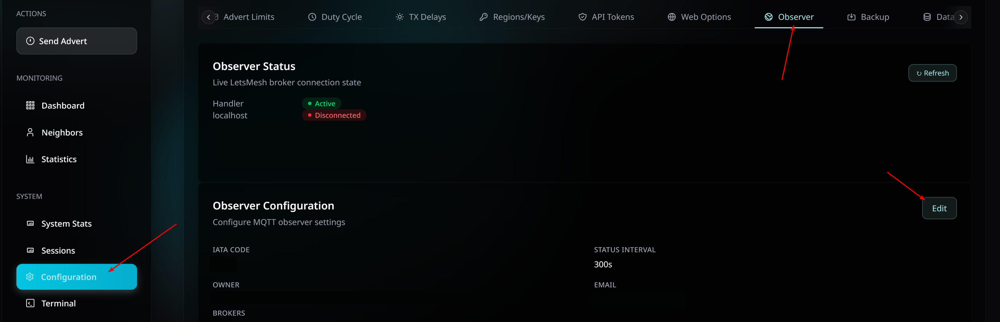
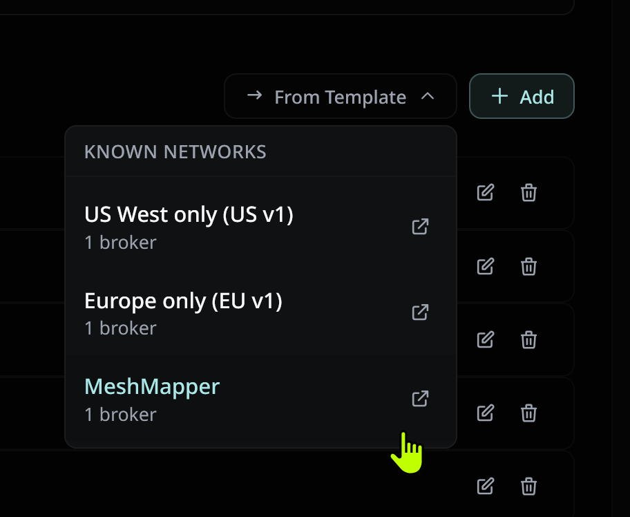
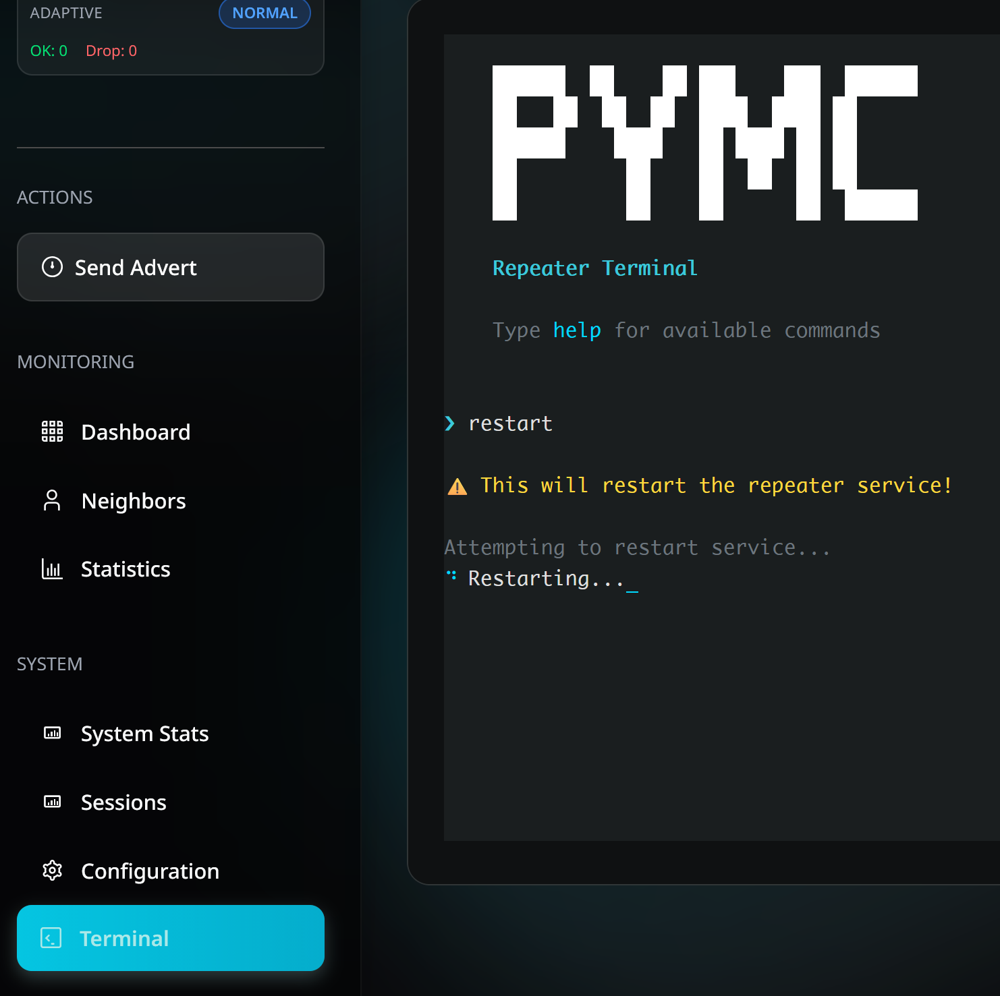

# PyMC Repeater MQTT Setup

These instructions cover adding the MeshMapper MQTT broker to an existing pyMC-Repeater installation. If you haven't set up pyMC-Repeater yet, refer to the [pyMC documentation](https://github.com/rightup/pyMC_Repeater) first.

*Thanks to mrzarquon and yellowcooln for providing the information for this guide.*

## Prerequisites

  - A Raspberry Pi with pyMC-Repeater installed and working

## Adding the MeshMapper Broker

### Option 1. Add MeshMapper from the UI

This is the easiest way to add MeshMapper to an existing pyMC-Repeater installation.

1. Open **Configuration > Observer**.
2. Click **Edit** next to **Observer Configuration**.



3. Click **From Template**.
4. Select **MeshMapper**.



5. Click **Save Settings**.
6. Open the **Terminal** option on the left.
7. Enter `restart` to restart the service.



Make sure `iata_code` in your pyMC config is set to your **MeshMapper region code**, or your observer won't show up.

### Option 2. Add MeshMapper manually

If you prefer, you can still add MeshMapper by editing the config file directly.

#### 1. Stop the Service

```bash
sudo systemctl stop pymc-repeater
```

#### 2. Edit the Configuration

Open the pyMC-Repeater config file:

```bash
sudo nano /etc/pymc_repeater/config.yaml
```

Under `mqtt:` → `brokers:`, add the MeshMapper entry below. If you already have other brokers listed, add this as another item in the list; don't replace them. Set `iata_code` to your **MeshMapper region code**, or your observer won't show up.

```yaml
mqtt:
  iata_code: <IATA> # your MeshMapper region code, e.g. "YOW"
  status_interval: 300 # How often a status message is sent (in seconds)
  owner: ""
  email: ""
  brokers:
    - name: MeshMapper
      enabled: true
      transport: websockets
      host: mqtt.meshmapper.net
      port: 443
      format: letsmesh # packet format, leave as-is
      disallowed_packet_types: []
      retain_status: false
      tls:
        enabled: true
        insecure: false
      use_jwt_auth: true
      audience: mqtt.meshmapper.net
```

Save and exit (`Ctrl+X`, then `Y`, then `Enter`).

#### 3. Start the Service

```bash
sudo systemctl start pymc-repeater
```

#### 4. Verify the Connection (Optional)

Follow the logs to confirm the broker connection is working:

```bash
sudo journalctl -u pymc-repeater.service -f | grep MeshMapper
```

## Verifying Your Observer

Once your observer is running and connected, it appears in your region's admin panel under the [Observers tab](admins.md#observers) after packets have been received (repeater or companion adverts, or wardriving pings). You should see a checkmark under the MeshMapper broker.

If nothing shows up, check the logs (`sudo journalctl -u pymc-repeater.service -f`) for MQTT errors, and confirm `iata_code` matches your region.
