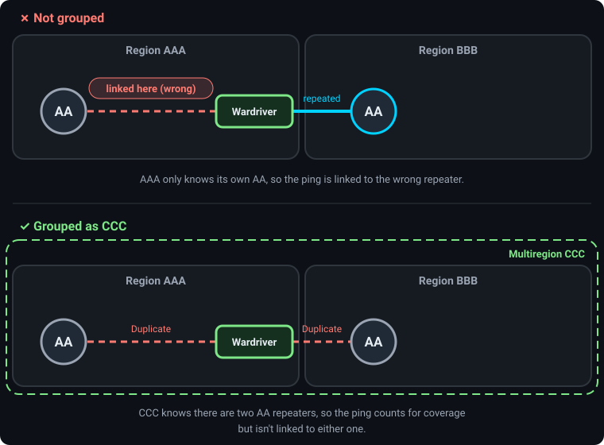

# Multiregion Groups

A Multiregion Group combines several neighboring regions into one map, so MeshMapper can correctly handle mesh traffic that crosses region borders.

## How it Works

When regions are grouped:

1.  **Unified Map**: The individual maps for each region are merged.
2.  **Shared Logic**: The system treats the group as a single entity for data processing.
    *   **Duplicate Detection**: Scans for duplicate repeater IDs across *all* regions in the group. If region `AAA` has a repeater `AA` and region `BBB` has a repeater `AA`, they are correctly flagged as duplicates of each other.
    *   **Leaderboards**: Statistics are combined. A user's contributions count towards the group leaderboard, and repeaters are ranked against all others in the group.
3.  **Centralized Administration**: Administrators can use a **Grouped Admin Panel** to monitor and manage every region in the group. Each region can still be administered on its own.

## When to Use a Multiregion Group

Multiregion groups are designed for specific scenarios where one region's mesh traffic can be heard by another.

### ✅ When to Use a Group
*   When repeaters in one region can be heard by observers in a neighboring region.
*   When wardriving in one region may have pings heard/repeated by repeaters in a neighboring region.

### ❌ When Not to Use a Group
*   When repeater adverts or wardriving traffic in one region would not be heard by repeaters or observers in another.  Combining two regions that cannot physically share mesh traffic can result in repeaters unnecessarily entering a collision/duplicate state.

## Why?

The primary reason to create multiregion groups is **data accuracy**. For example:

A wardriver near the border of region `AAA` sends a ping. Region `AAA`'s repeater `AA` is too far away to hear it, but region `BBB`'s repeater `AA` is close enough and repeats it. MeshMapper sees a successful round trip through a repeater with ID `AA`.

*   ❌ **Not grouped**: `AAA` only knows about its own `AA`, so it links the ping to the wrong repeater.
*   ✅ **Grouped**: MeshMapper knows both regions have an `AA`, so the ping still counts for coverage but isn't linked to either. Select the ping on the map to see **Duplicate** lines to each possible repeater, and open it to see the candidates with their signal info.

This mainly affects repeaters using 1-byte IDs. Repeaters using [multi-byte IDs](multibyte.md) are usually told apart even when their first byte matches.

## Administration

Managing a multiregion group is similar to managing a single region. In the grouped admin panel, tools like "Replace Repeater" and "Bulk Update" apply to every region in the group.

## Requesting a Multiregion Group

Each region in a group keeps its own data, so regions can easily be added to or removed from a group. Please reach out to a [Global Administrator](administratorlist.md) to start the process.