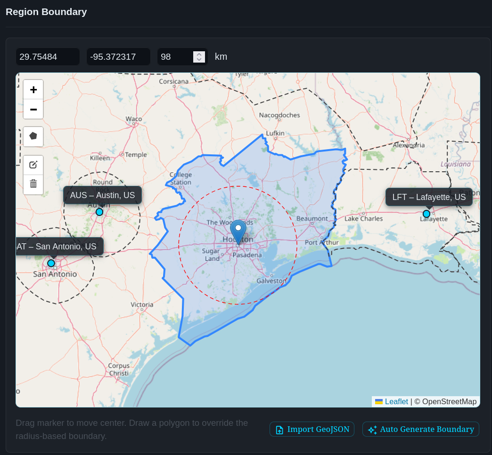
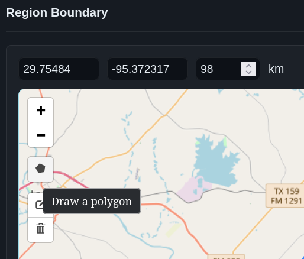
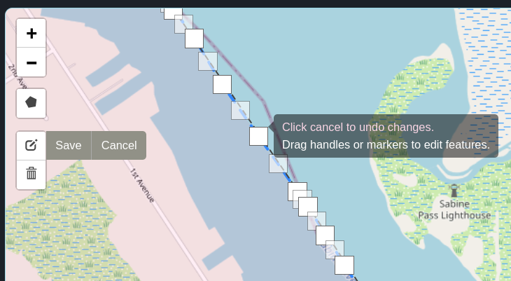
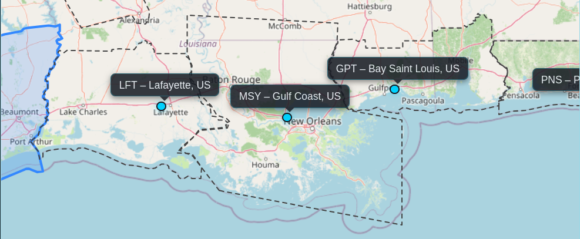
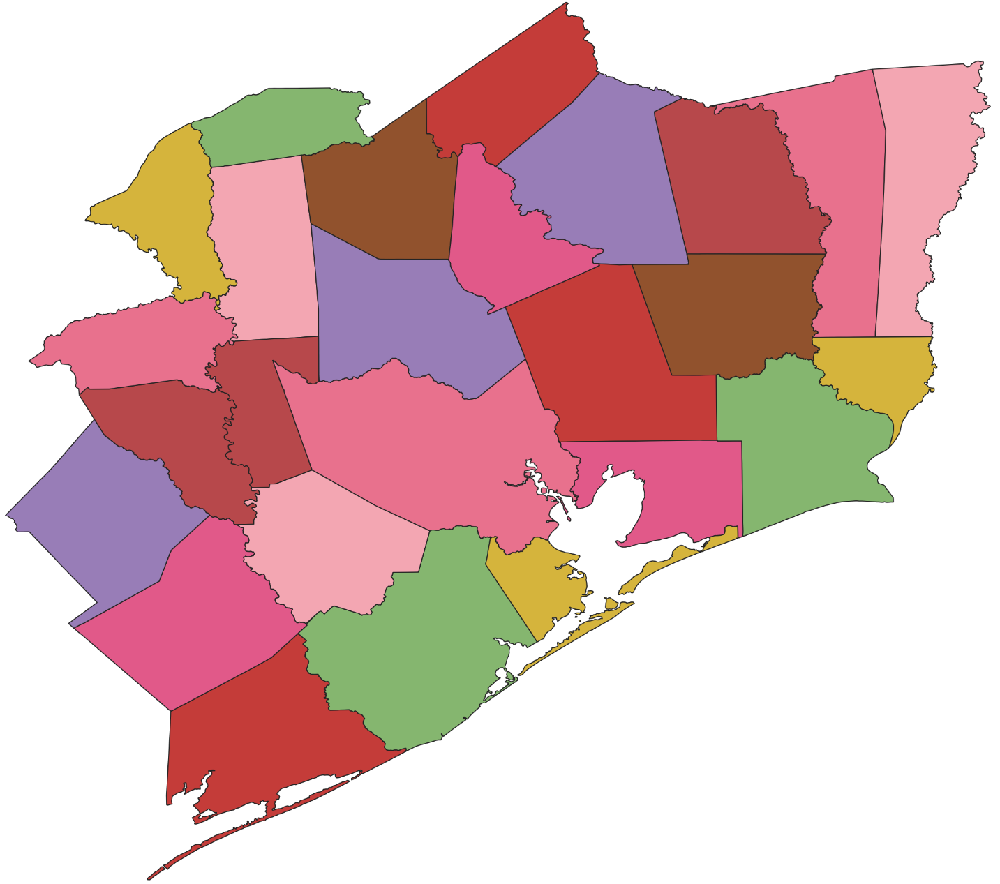
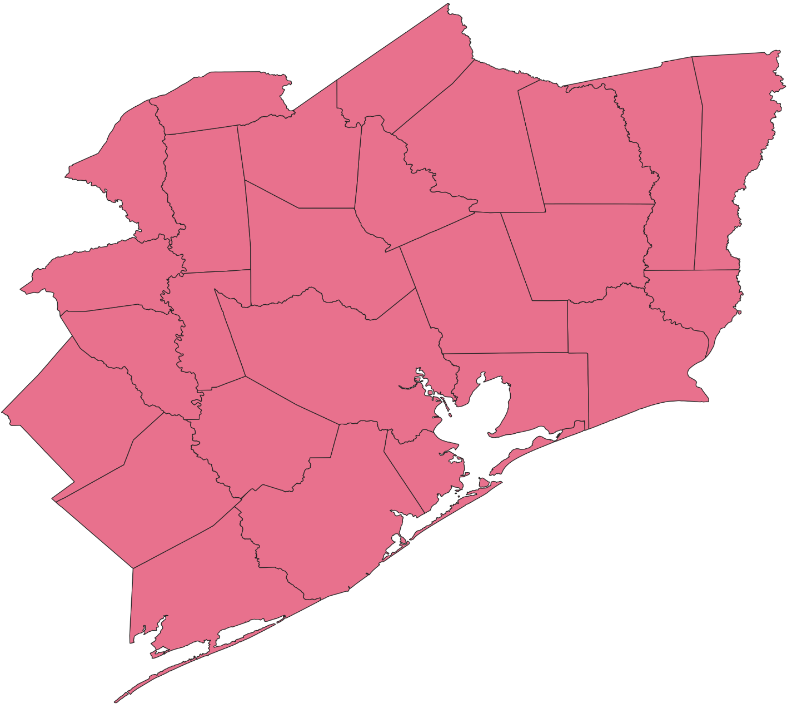
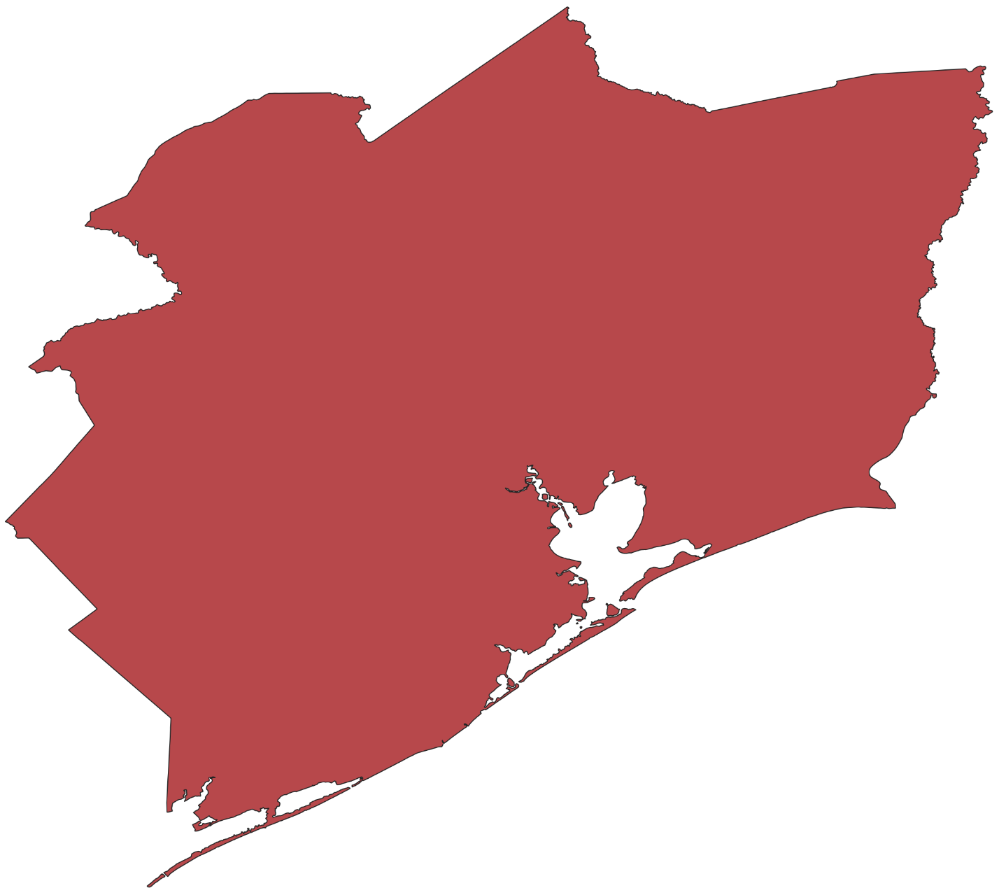
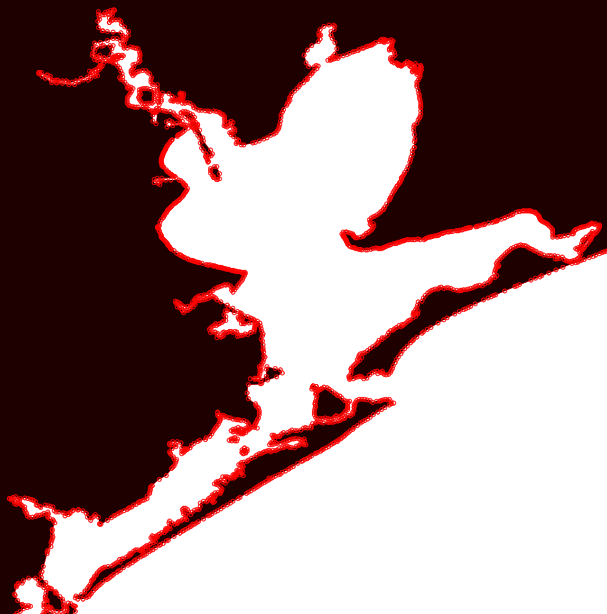

# Defining a Region's Boundary

MeshMapper allows for different methods of defining a region's boundary using the web utilities in the region admin panel: defined radius around a point (default), manually defined polygon from user-input points, and imported geoJSON formatted text blocks.

All of the following methods are accessed via the admin panel for each region, under the `Settings` menu. Scroll to near the bottom of the page to reach the `Region Boundary` interface.

## Radius Around a Point

The default method of defining a region's boundary is by using a defined radius around a center point.  For this method, the admin drops/moves a marker pin onto the map at the center of the desired region, then sets a radius distance around that point.  The region boundaries will be circular, with no consideration given to political or geographical boundaries.

In the image below, the radius-based boundary line is shown as a red dashed line.  Its center point is shown both as a dropped pin on the map and as GPS coordinates just above the top left corner of the map.  The radius distance (in km) is input next to the GPS coordinates. This boundary type is overridden - but still displayed to admins - if any polygon-based boundary is used.

## Manually Defined Polygon Boundary

This type of boundary is created using the map interface and mouse. Use the `Draw a Polygon` button (the filled pentagon just below the zoom buttons) to start the process.  At each desired vertice of the polygon, single click the left mouse button to add a point.  Proceed methodically around the desired edges (we recommend going either clockwise or counterclockwise consistently around the edge, and once finished then return to make any adjustments or corrections).  This continues until the last vertice is placed, then mouse over to the original starting vertice and double click it to complete the polygon.  To cancel a drawing in progress, press the Escape key on your keyboard.

To edit an existing polygon, use the `Edit Layers` button, located just above the trashcan on the left side of the map.  Pressing this will display all of the vertice points in the existing polygon and allow you to: click and drag them to new positions, delete them by single clicking a shaded square, and add new vertices by single clicking the hollow squares that appear halfway between existing vertices.  When finished, be sure to click the `Save` button next that appeared next to the `Edit Layers` button when you activated edit mode.

## geoJSON Polygon Boundary

### Importance of Interregion Coordination

This method of creating a region boundary involves assembling a geoJSON file with a single polygon shape, then copying the text inside the file and pasting it into the admin interface.  The primary benefits of using this method are to reduce interregion overlap, to provide consistency with region edges when wardriving, and to easily incorporate planned future mesh expansion in defined political or geographical boundaries.  Several regions have seen success with geoJSON boundaries using political boundaries as the defining lines - e.g. county/parish boundaries in the U.S.  If wardriving users know that region boundaries follow a given political boundary or highway, the experience when wardriving is made easier to plan routes or to know when to activate wardriving in the MeshMapper app.  With coordinated boundaries between regions, users can seamlessly transition between them without manual intervention in the app.

It is **strongly** recommended to coordinate with neighboring region administrators when planning region boundaries.  The image below shows a series of regions between roughly Houston, Texas, and Pensacola, Florida where the regional admins have successfully coordinated boundaries.  Wardrivers could start to the west of Houston and drive east past Pensacola without interruption in data collecting if so desired.

The image below shows how the aforementioned regions have drawn their boundaries using geoJSON files.

### Constructing the geoJSON File

Once a method of defining a region's boundaries has been chosen, the next step is to find a GIS data source from which to construct the geoJSON file.

*Note: MeshMapper expects a single contiguous polygon.  Areas with islands or other disjointed boundaries may require manual editing before importing.  Double check your data source to see if this applies to you.*

Some available resources for GIS data based on political boundaries include:
 - [Vercel Boundary Maker (US Counties - Creates ready-to-import geoJSON files](https://nc-boundary-maker.vercel.app/)
 - [Canadian Provincial Boundaries](https://open.canada.ca/data/en/dataset/85efc01b-163f-ebba-2378-c43eadfb3b3f/resource/4137a99d-f5dd-4e69-9e13-a587ff6eaa55)
 - [Canadian Census Boundaries](https://www12.statcan.gc.ca/census-recensement/2021/geo/sip-pis/boundary-limites/index-eng.cfm)
 - [United Kingdom Local Authority Districts](https://geoportal.statistics.gov.uk/datasets/ons::local-authority-districts-may-2025-boundaries-uk-bfc-v2/about)
 - [Australian Administrative Boundaries](https://data.gov.au/data/dataset/geoscape-administrative-boundaries)
 - [New Zealand Geographic Data Service](https://datafinder.stats.govt.nz/)

 If your data set is not ready to import into MeshMapper (already formatted as a single contiguous polygon including the intended area for your region), you will likely need GIS software to make the necessary edits and export to geoJSON format.  One commercial product is [ArcGIS Pro](https://www.esri.com/en-us/arcgis/products/arcgis-pro/overview).  A free, open source alternative is [QGIS](https://qgis.org/)
 
 While it is beyond the scope of this document to outline every possible necessary step to prepare a dataset for import into MeshMapper, the general process is as follows:
  1. Import your data into your GIS software suite of choice
  2. Merge multi-polygons into a single polygon layer
  3. Dissolve the single polygon layer to remove internal borders and any remaining data from previous multi-polygons
  4. Clean your polygon shape for importing into MeshMapper (remove areas that aren't contiguous) if necessary
  5. Export your cleaned layer to geoJSON, copy the contents of that file, paste into the MeshMapper admin panel

Using the [Houston region](https://hou.meshmapper.net) as an example, the process is illustrated in the images below:

Importing data:

Merging data:

Dissolving data:

Cleaning data (deleting islands & other disconnected areas):

Again, it is beyond the scope of this document to attempt to explain or troubleshoot all possible situations when dealing with GIS data.  There are many, many tutorials and troubleshooting tips available with a web search.  The goal is to produce a single *contiguous* polygon shape in geoJSON format and then import that data into MeshMapper via copy/paste.
