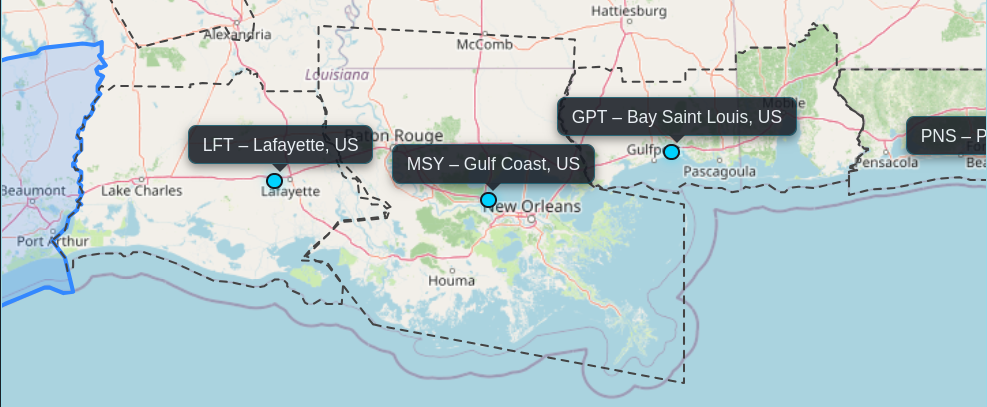

# Defining a Region's Boundary

Every region needs a boundary. It decides where wardriving counts for the region, and what's drawn as the region's border on the map.

The easiest way is **Load Boundary**, which builds the boundary from real state/province, county or local borders from OpenStreetMap. You can also draw one by hand. The region's radius is worked out from the boundary automatically.

!!! tip "Coordinate with your neighbours"
    Regions can't overlap, so coordinate with neighbouring region administrators. Following the same borders (e.g. county lines) lets wardrivers cross from one region to the next without interruption.

## Opening the Editor

Open your region's admin panel, go to **Settings**, and expand **Region Boundary** (the last section). Click **Save All Settings** when you're done. You can't save while a boundary edit is still open; click **Done** on the map first.

Before a big change, click **Export GeoJSON** to download the current boundary. The history records that the boundary changed, but it doesn't keep a copy of the old shape. If you lose a boundary, ask a global administrator for help.

## Load Boundary (Recommended)

  1. Check the **Country** code (two letters) above the map.
  2. **Drag the pin** to the middle of your region. The borders around it load automatically, or click **Load Boundary** (shown on the map as **Auto Boundary** in the admin panel).
  3. Choose a level: **State/Prov**, **County** (default) or **Local** (municipality, where available; otherwise County is used).
  4. **Click the green areas** you want, or Ctrl/Shift-drag a box around several. Use the arrows around the pin to load more areas.
  5. Click **Use selected** to merge them into one boundary.

On the map, **purple** is existing regions, **green** is areas you can pick, and **blue** is your selection. Areas that belong to another region can't be picked.

The **OSM | GB** switch picks the source: OpenStreetMap (default) or geoBoundaries (cut at the shoreline).

### Coastlines and Islands

  - **Fill water between** (under **Advanced**): when merging, fills water between islands and the mainland.
  - **Extend over water**: sketch an area over water and add it to the boundary.

## Drawing or Editing by Hand

  - **Draw**: under **Advanced Mapping**, click **Draw Boundary**. Click the map to add points, then press Enter or click **Finish**. Press Esc to cancel.
  - **Edit**: click **Edit** on the map. Drag points to move them. Click a grey dot or double-click an edge to add a point. Press Delete or right-click to remove one (or use **Delete point(s)**). Click **Done**, then **Save All Settings**.
  - **Clear**: click **Clear** to remove the boundary and start again.

## Custom GeoJSON (Special Circumstances Only)

Custom GeoJSON boundaries are only accepted in special circumstances. Use **Load Boundary** unless the MeshMapper team has asked you to import a file.

To import one, click **Import GeoJSON** under **Advanced Mapping**, then upload the file or paste its contents and click **Import**.

  - Accepted: `Polygon`, `MultiPolygon`, `Feature` and `FeatureCollection`.
  - The largest area becomes the boundary; others appear as dashed outlines you can click to use instead.
  - Only one outline is saved, and holes are ignored.
  - Files aren't simplified, so very detailed files may slow your browser.

## Example: Coordinated Regions

The regions between roughly Houston, Texas and Pensacola, Florida share county-based borders, so a wardriver can drive from west of Houston to past Pensacola without interruption.

