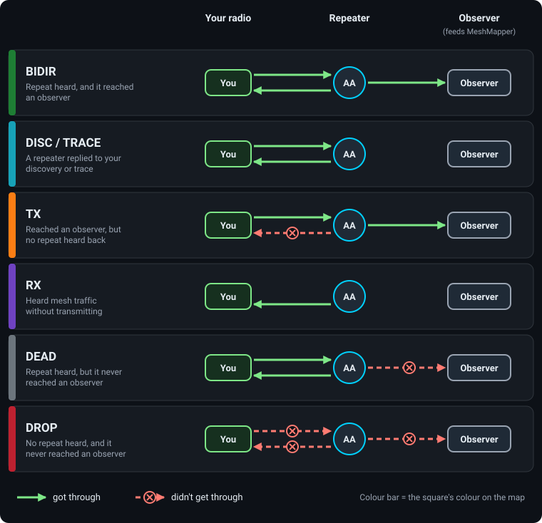

# Understanding Visuals

This page explains every mark on a region map (grid squares, repeater chips, lines and the details panel), roughly in the order of the **Legend** card in the bottom-right corner.

!!! note "Colours on this page are the Default palette"
    MeshMapper also has four colour vision palettes (Protanopia, Deuteranopia, Tritanopia and Achromatopsia) under **Settings > Accessibility > Colour Vision**, and each one remaps these colours. Backbone gold, for example, becomes white in all four. See the [colour vision options](layers.md#accessibility). Where a mark also has a distinctive shape or position, this page says so.

## The Grid System

The map is divided into grid squares: **300 m** in **Simplified** mode and **100 m** in **Detailed** mode (change it with **Grid Mode** in [Settings](layers.md#settings)). In Detailed mode each ping fills a 3×3 block of squares around where it was sent.

A square can hold many pings, so it shows the **best** result it has, in this order:

| Priority | Colour | Type |
| --- | --- | --- |
| **1 (Highest)** | **Green** | BIDIR |
| **2** | **Cyan** | DISC / TRACE |
| **3** | **Orange** | TX |
| **4** | **Purple** | RX |
| **5** | **Grey** | DEAD |
| **6 (Lowest)** | **Red** | DROP |

*Example:* A square with 10 red pings and 1 green ping shows **green**, because coverage is possible there.

Clicking a square highlights it and dims the rest of the coverage. The other [coverage modes](layers.md#coverage-modes) (Effective Coverage, Signal Strength, Ping Age, Noise Floor) colour squares differently and each has its own legend.

## Ping Types Defined

What decides a ping's type is whether your radio heard a repeat, and whether the ping reached MeshMapper's observers.

  - **BIDIR** - *Green*
    - Heard repeats from the mesh **and** successfully routed through it. A solid two-way link.
  - **DISC** - *Cyan*
    - Your radio sent a discovery request and heard a repeater reply.
  - **TRACE** - *Cyan*
    - Your radio sent a trace and heard the reply. Shown the same as DISC on the map.
  - **TX** - *Orange*
    - Successfully routed through the mesh, but your radio heard no repeats back. Often a sign you can reach the mesh but can't hear it well.
  - **RX** - *Purple*
    - Your radio heard mesh traffic but didn't transmit. Useful for mapping where the mesh can be heard.
  - **DEAD** - *Grey*
    - A repeater heard it, but no other radio received the repeat. Often a repeater that isn't well connected to the wider mesh.
  - **DROP** - *Red*
    - No repeats heard **and** no successful route. A likely dead zone.

## Repeaters

### Chip Anatomy

A repeater is drawn as a small dark chip carrying its hex ID (at the width it advertises, 1–3 bytes):

  - The **body** is always dark slate, in every state and palette.
  - The **state** is shown by a thick bar down the **left edge** and the chip's border.
  - The **ID** is always white.

Scan for the **edge colour**.

### Repeater States

| State | Edge Colour | Meaning |
| --- | --- | --- |
| **Active** | **Green** | Heard from recently. The ordinary state. |
| **New** | **Pink** | First seen in the last 14 days. Drawn slightly larger, with a glow. |
| **Stale** | **Grey** | No advert within the region's window (24 hours unless the admin changed it). |
| **Ambiguous** | **Red** | Its ID matches another repeater's at the width it advertises, so pings can't be credited to it with certainty. See [Duplicate Repeater IDs](duplicaterepeaterid.md). |
| **Backbone site** | **Gold** | One of the repeaters carrying the most traffic. See [The Backbone](#the-backbone). |

If more than one applies, **Ambiguous** wins over **Stale**, which wins over **New**. So a new repeater that has gone quiet shows grey, not pink. Gold only replaces **Active**.

### Observers

An **observer** is a repeater that also feeds packets to MeshMapper. Its chip has an eye (👁) in front of the ID. The eye isn't a state, so an observer can be in any of the states above.

### Groups

In **Simplified** mode, repeaters too close together to draw apart collapse into a round **badge**:

  - The **number** is how many repeaters are in it (e.g. `1.4k` past 1000).
  - The **ring** is the colour of the most common state in the group.
  - The **dots** underneath show which states are present, one dot per state. They don't show how many.

**Click a badge** to fan the repeaters out. Large groups (more than 18) zoom in instead when you're zoomed well out.

Badges aren't used in **Detailed** mode, or while Repeater Neighbours, Repeater Scopes, Backbone or Visualize Live is on.

## Links Between Repeaters

The **Repeater Neighbours** overlay draws lines between repeaters known to reach each other. All are solid, so the colour tells them apart.

| Line Colour | Kind | Meaning |
| --- | --- | --- |
| **Green** | Inferred, fresh | Seen next to each other in a packet path an observer heard, in the last 3 days. |
| **Orange** | Inferred, older | The same, but older than 3 days. Hidden after 7 days (unless the admin changed it). |
| **Blue** | Reported | The repeater reported the other as a neighbour when an observer asked. Kept 30 days by default. |
| **Purple** | Uploaded | A wardriver's app collected the repeater's neighbour table and uploaded it. Kept until replaced. |

If a pair has a Reported or Uploaded link, the inferred line for that pair isn't drawn.

The **Repeater Scopes** overlay uses the same blue and purple, but shows inferred links in **grey**. See [Repeater Scopes](layers.md#repeater-scopes).

!!! note "Orange means two different things"
    An orange **square** is a TX ping. An orange **line** is an older inferred neighbour link.

## The Backbone

The **Backbone** overlay shows the repeaters the region leans on most: the smallest set whose links carry **half** of the region's traffic. For how it's calculated, see [Backbone](backbone.md).

  - **Percentages**: each backbone chip shows **its own share** of the region's traffic (e.g. `A1B2 7.4%`). The shares **add up** to about half; they aren't slices of one number. Chips show their share even with the overlay off.
  - **Gold doesn't mean healthy**: gold only replaces Active. A backbone repeater that's New, Stale or Ambiguous keeps that colour, so not every backbone site is gold.
  - **Trunks**: lines between backbone sites. Each site keeps its three busiest links. The colour is the trunk's **rank**, busiest (red) to quietest (pale yellow), not an amount of traffic. Line width means nothing.
  - **Turning it on** shows only backbone repeaters, turns **Repeaters** on, and turns **Repeater Neighbours** and **Repeater Scopes** off.
  - **On a group map**, the whole group is scored as one pool, so a small member region may have two backbone sites or none.

## Signal (SNR)

Wherever the map colours something by signal quality, it uses three bands:

| Band | Colour | Quality |
| --- | --- | --- |
| **Over 5 dB** | **Green** | Strong |
| **-1 to 5 dB** | **Dark Yellow** | Moderate |
| **Under -1 dB** | **Red** | Weak |

If the signal can't be read, it's shown in **grey**.

## Ping Details

Click a grid square to see its pings. By default details open in the **Sidebar**; you can switch to **Popup** under **Info Panel** in [Settings](layers.md#settings).

### Summary

When a square has more than one ping, you see a summary first: **Total Pings**, a count for each type, the average signal (**AVG SNR**), the furthest distance to a repeater (**MAX DIST**) and the average noise floor (**AVG NOISE**).

  - **Sidebar**: below the summary is a **Ping History** list, newest first. Click a card to see that ping.
  - **Popup**: use the **<** and **>** buttons to step through pings, newest first.

### A Single Ping

  - **Type**, **time** and who sent it (unless the region hides names).
  - **Power**, and whether an **external antenna** was used.
  - **Radio preset** (frequency / bandwidth / SF / CR).
  - **Heard Repeats**: every repeater your radio heard repeat the ping, strongest signal first. For DISC and TRACE this shows the repeater that replied, with local and remote signal.
  - **Via**: the repeaters that carried the ping to MeshMapper's observers.
  - A repeater shown as **(AMBIGUOUS)** lists its possible **Candidates**. One shown as **(hidden)** is a [private repeater](layers.md#private-repeaters).
  - **Ghost** means the ping named a repeater that has never been registered on this map. **Gone** means a repeater that was placed before can no longer be matched (for example, it has moved).
  - The **link icon** copies a direct link to that ping.

### Lines on the Map

While a ping is selected, lines show how it connected:

  - **Solid coloured line**: a repeater your radio **heard**, coloured by [signal](#signal-snr).
  - **Dark blue line**: the **Via** route the ping took.
  - **Red line** labelled **Duplicate**: a possible repeater when the ID is ambiguous.

## Repeater Details

Click a repeater chip to see its details. The rest of the coverage dims so its own coverage stands out (see **Repeater Coverage** in [Overlays](layers.md#overlays)).

  - **Status**: Repeater Online, Backbone Site, New Repeater, Stale Repeater, Ambiguous (with the other repeaters sharing its ID), Inactive or Disabled.
  - **Clock warning**: "Repeater time is not set correctly" if its clock was more than 120 seconds off when last checked in the past week.
  - **Details**: ID and advertised ID width (**Advert Bytes**), power, **First Heard**, **Last Heard**, **Max Range**, and any hardware, antenna, height, power source and site notes the admins have added.
  - **Freq**: the radio presets it has been heard on.
  - **Mesh Scopes**: the scopes it carries. See [Repeater Scopes](layers.md#repeater-scopes).
  - **Traffic rank**: where it ranks for traffic in the region, and its share.
  - **Stats**: ping counts by type and a signal-vs-distance chart.
  - **Neighbours**: repeaters it links to, marked **I** (inferred), **R** (reported) or **U** (uploaded), with direction, signal each way, packet count and last seen. Click one to draw that link.
  - **Recent Adverts** (sidebar): its adverts from the last 7 days.
  - **Add Another** (sidebar): compare several repeaters' coverage side by side.
  - The **link icon** copies a direct link to the repeater.

## Private Repeaters

Repeaters whose name starts or ends with 🚫 are hidden from the map. See [Private Repeaters](layers.md#private-repeaters).
